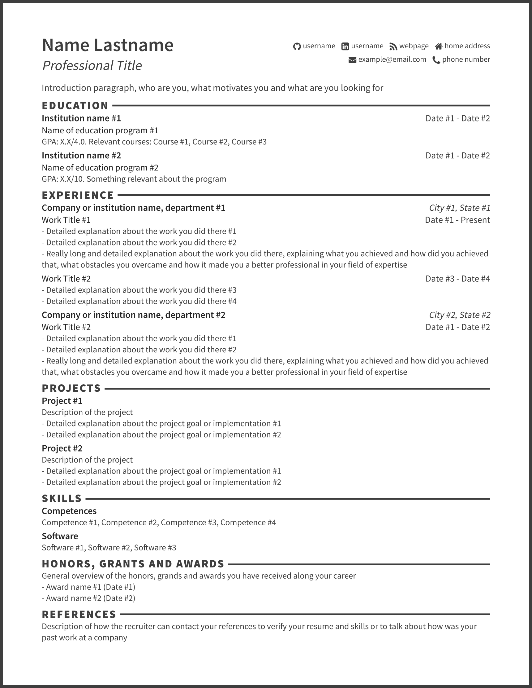

# Resume Generator

Generate elegant resumes from a single YAML data file.
Export them to HTML, JSON, Markdown, text, XML or PDF.

Examples
----
* [Original YAML](example.yaml)
* [Generated HTML](output/example.html)
* [Generated JSON](output/example.json)
* [Generated Markdown](output/example.md)
* [Generated text](output/example.txt)
* [Generated XML](output/example.xml)
* [Generated PDF (printed from the HTML with Firefox)](output/example.pdf)

Screenshot

Prequisites
----
* [The Go Programming Language](https://golang.org/)
  * [go-yaml](https://github.com/go-yaml/yaml): install running `go get gopkg.in/yaml.v2`

Run
----
* Make sure your data file is named `resume.yaml`, in the project's root folder (use `example.yaml` as a starting point).
* Generate the resume by executing `make resume`.
* To save your resume in PDF format, you may follow one of the following options:
  * Open the generated HTML in Firefox. Print it as PS (Postcript), with background images, no scaling and no margins. Then transform it to PDF using `ps2pdf` or a similar utility.
  * Open the generated HTML in Chrome and save it as PDF.
  * (Requires Chrome >= 59) Run `chrome --headless --disable-gpu --print-to-pdf <html-file>`, where `<html-file>` is the path to the generated HTML.

License
----
[MIT](LICENSE) - Feel free to use and edit.

Tech
----
* [Font Awesome](https://fortawesome.github.io/Font-Awesome) - icons
* [The Go Programming Language](https://golang.org/)
  * [go-yaml](https://github.com/go-yaml/yaml) - yaml parsing package
